# Service Finder using google Api's
This project was part of IOS application developement program in semester 7 of "Prject developement" course.I have developed this program using swift,firebase and google api services .

##Demo link: 
## INTRODUCTION
In this 21st century modern world life has become convenient with facilities like restaurant, theatre, petrol pump etc easily available within our reach. But sometimes
problem arises when we are in a remote area and want to find these services. We may use the internet and find them manually by typing the location and searching the services
individually.But it becomes time consuming. ‘Service finder using Google API’ detect the loacation of the user and tells the nearest available services.

## Project Details
This application is an IOS based project to find out nearby services within a particular radius when the user enters a location and can also detect the user’s location. It suggests
the nearest service available along with the address and contact details .It displays the services as according to map view or table view as chosen by the user. A list of favourites
are also displayed alongside. The user can add his favourites according to the place he frequents or likes and can view them any time. It provides high level of security andintegrity of the data held by the system. Only authorized users with valid username and
password can access the application.

## Purpose
The application uses location-based service (LBS) i.e. a software-level service that uses location data to control features
1. Users can easily find nearby locations in case of emergency.

2.Users can get an overview of the place or service based on other users ratings.

The App is a GPS service based application which would help us in locating the exact geo-position of people (any single entity of a large set) depending upon their current
location/whereabouts. Geo-position would be displayed on the map view on our android set and display functioning can analogue to the current usage of Google Maps Service.

## Some Key points about the App:
--> All users’ locations would be retrieved from an online database so as to
centrally control the permissions for viewing.
  
-->For restricting user access, user authentication would be supported.

--> Periodic refreshing has to be present so that each time the geo–location
changes or after a fixed interval of time the values in database should be
updated.

--> All devices would be having a unique ID (UID) and this would be used for
searching for the user.

!--The app would have additional support in terms of
o Map View and List View
o Add favourites
o Better UI
o Zooming In / Zooming Out
o User Data Manupalation
o Change of UID support

##Software requirements

 Front End : Swift 3

 Back End : -

 Technology :XCode7

 Code behind language: Swift 3

 Libraries: Google API 3.5

## Use-Case Diagram
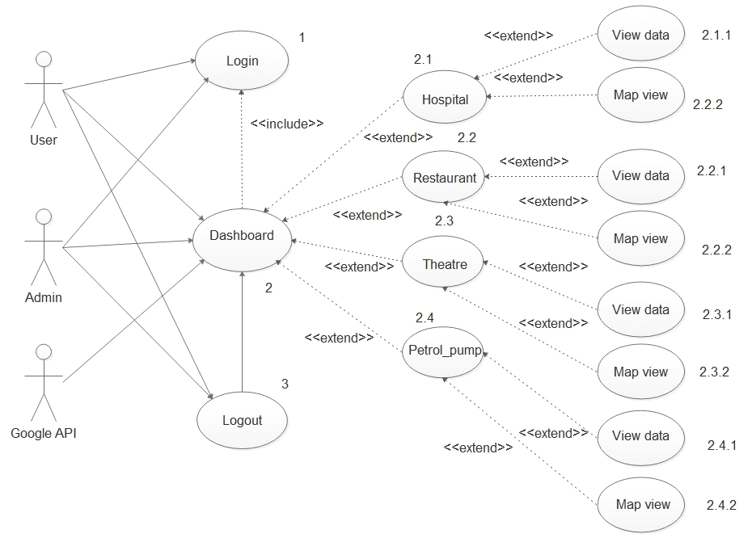

## table schema diagram
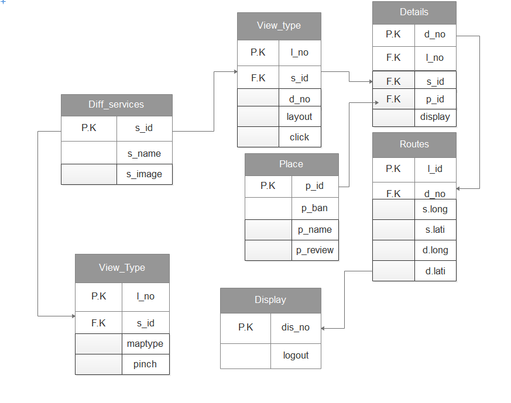

## ER-diagram
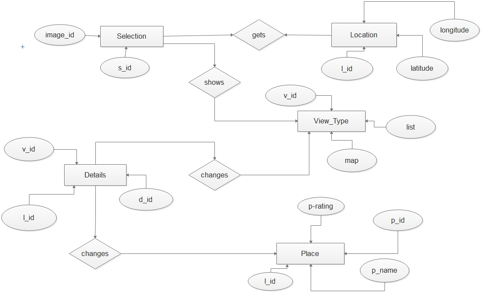

## Deployment diagram
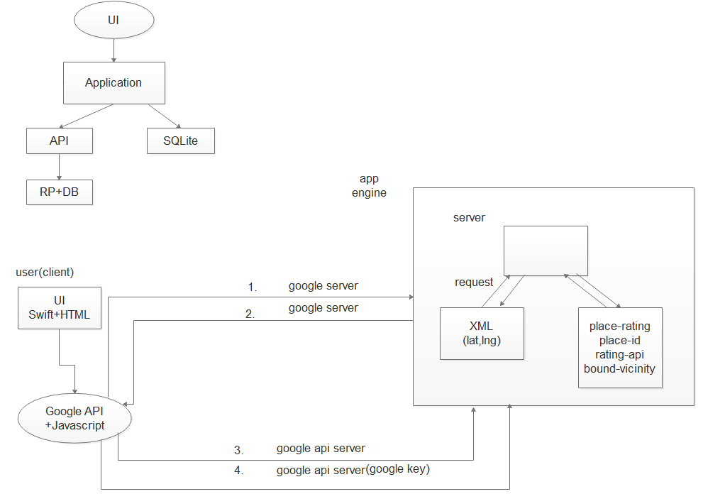

## class diagram
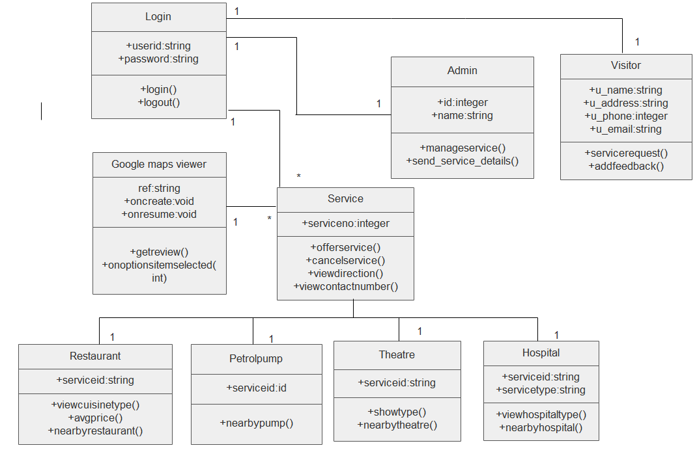

## Implementation Environment
Multi-user vs. Single-user:

Single user applications are the application where it is useful to only one user at a
time. While in Multi user application is used by many user at the same time and thus
application are used by many users at the same time. Our system is a multi-user
system as we have more than one user who can use the system at a same time.

GUI vs. Non-GUI:

Non GUI application uses command Prompt for input and output while GUI
application has graphics form to interface and other graphics property for various I/O
operation and are easy to use. Our System is a GUI based and thus easy and effective
to use therefore user can easily give input and take Output.

## IMPLEMENTATION PLANNING--File naming convention

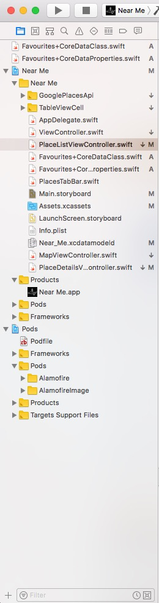

## Designing

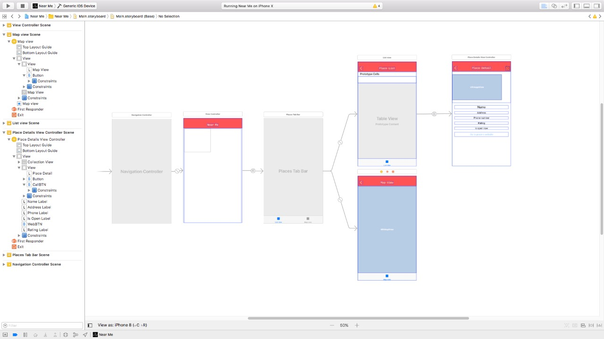

## Declaration standard

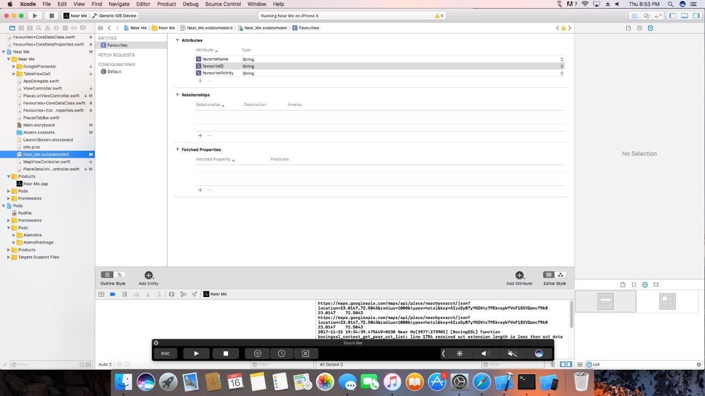

#Screenshots of testing

main menu after login--

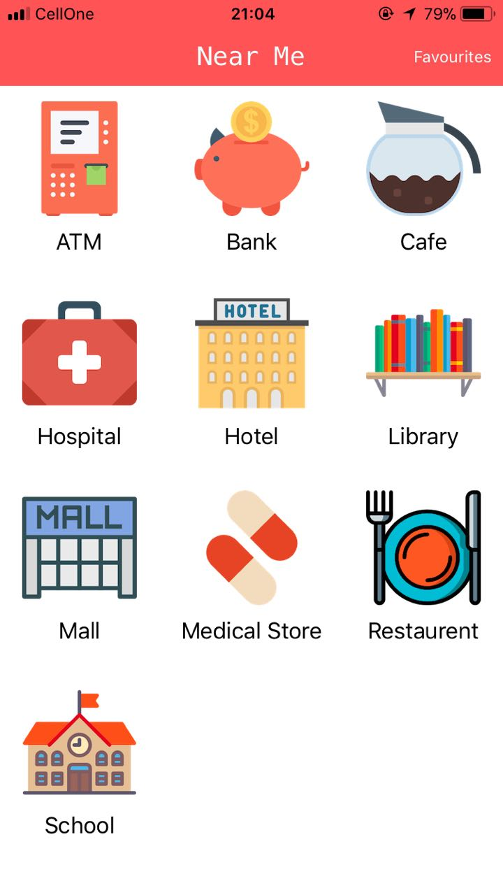

ATM near me 

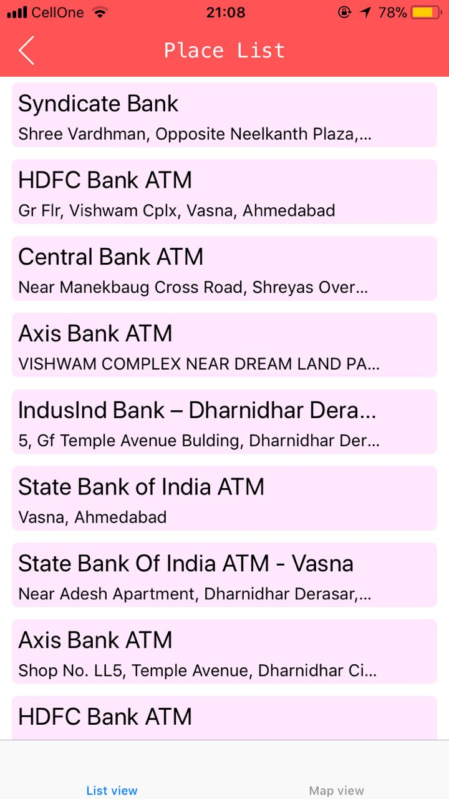

Education Centers near me

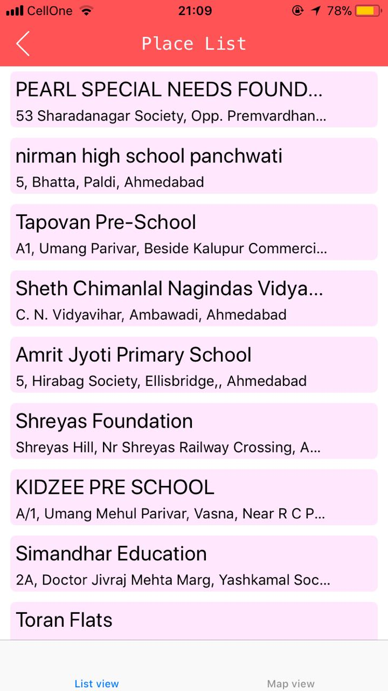

cafes near me -1(first 10)

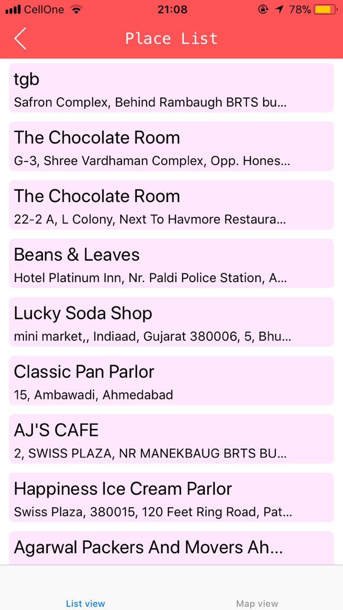

cafes near me -2 (second page after 10 first entry) 

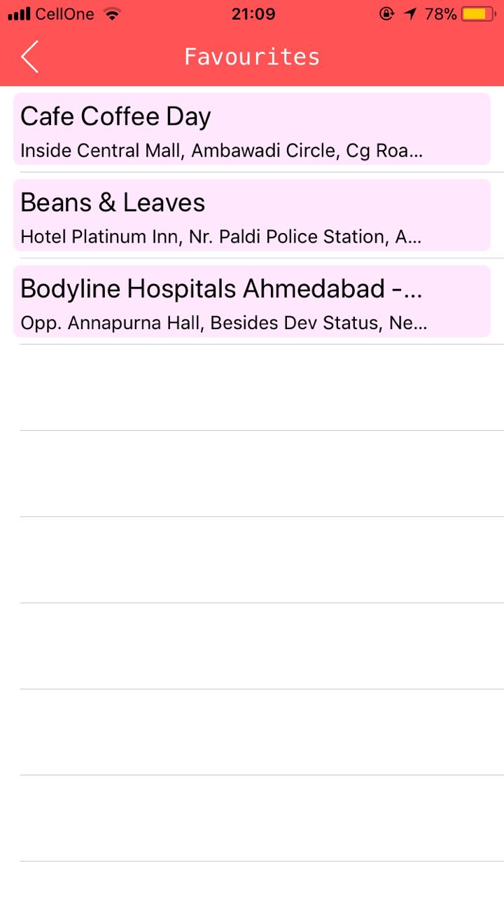

phrmacy near me

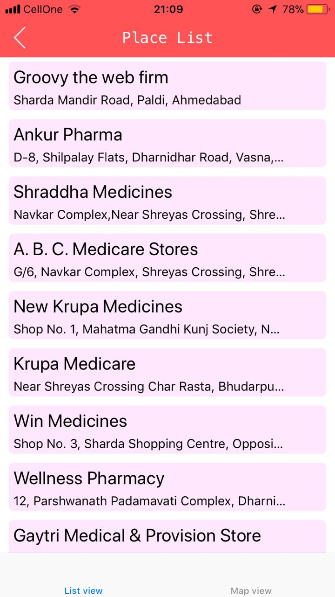

Map view for restaurants

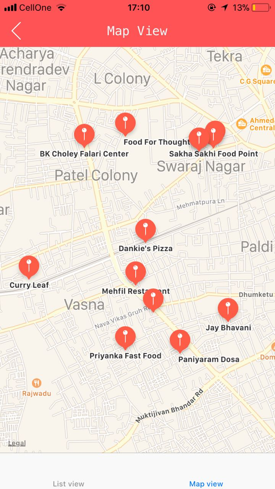

#AUTHORS

Raj shah

Please give star and fork the code to update .Feel free to contact me at : shahraj121997@gmail.com .Have a great one!!!!

